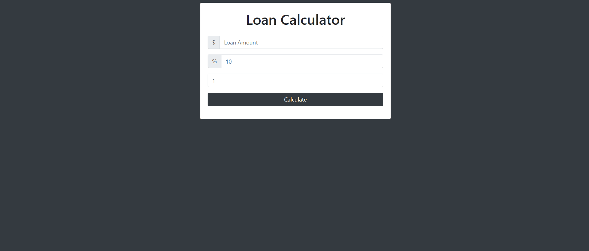

# Loan Calculator

## Content

<a text-align="center" href="#about">About</a>&nbsp;&nbsp;&nbsp;|&nbsp;&nbsp;&nbsp;
<a href="#description">Description</a>&nbsp;&nbsp;&nbsp;|&nbsp;&nbsp;&nbsp;
<a href="#live">Live Demo</a>&nbsp;&nbsp;&nbsp;|&nbsp;&nbsp;&nbsp;
<a href="#screenshots">Screenshot</a>&nbsp;&nbsp;&nbsp;|&nbsp;&nbsp;&nbsp;
<a href="#with">Built with</a>&nbsp;&nbsp;&nbsp;|&nbsp;&nbsp;&nbsp;
<a href="#setup">Setup</a>&nbsp;&nbsp;&nbsp;|&nbsp;&nbsp;&nbsp;
<a href="#prerequisites">Prerequisites</a>&nbsp;&nbsp;&nbsp;|&nbsp;&nbsp;&nbsp;
<a href="#author">Author</a>

## About 

Loan Calculator is a project intended to showcase DOM Manipulation skills using Vanilla JavaScript. The user interface is designed using Bootstrap.

<h3>Description </h3>
<h4>This project allows a user to:</h4>
<li>Enter loan amount, interest rate and years to repay</li>
<li>Calculate monthly payment, total payment and total interest</li>
<li>Get useful feedback if invalid amount is entered</li>

## 🔴 Live Demo 

**Click [here](https://loancalculator-js-temesghen.netlify.app/) in order to see a Live Demo of this project.**

## Screenshots 

### Wide Screen
 

## 🔧 Built with

- HTML
- Bootstrap
- Vanilla JavaScript
- ES6
- ESLint

## 🔨 Setup
### Run a Local Copy
- Download the repository to a local directory on your computer.
- Or run the following commands on the terminal
  - git clone https://github.com/temesghentekeste/loan-calculator-js.git
  - cd loan-calculator-js
  - open index.html file

## Prerequisites
- A modern up-to-date browser

## ✒️  Author 

👤 **Temesghen Tekeste**

- Github: [@temesghentekeste](https://github.com/temesghentekeste)
- Twitter: [@temesghentekes1](https://twitter.com/temesghentekes1)
- Linkedin: [temsghen tekeste](https://www.linkedin.com/in/temesghentekeste/)

## 🤝 Contributing

Contributions, issues and feature requests are welcome!

Feel free to check the [issues page](https://github.com/temesghentekeste/loan-calculator-js/issues).

## 👍 Show your support

Give a ⭐️ if you like this project!

## :clap: Acknowledgements
- <a href="https://www.udemy.com/course/modern-javascript-from-the-beginning/" target="_blank">Modern JavaScript From The Beginning</a>
- <a href="https://www.microverse.org/" target="_blank">microverse.org</a>

